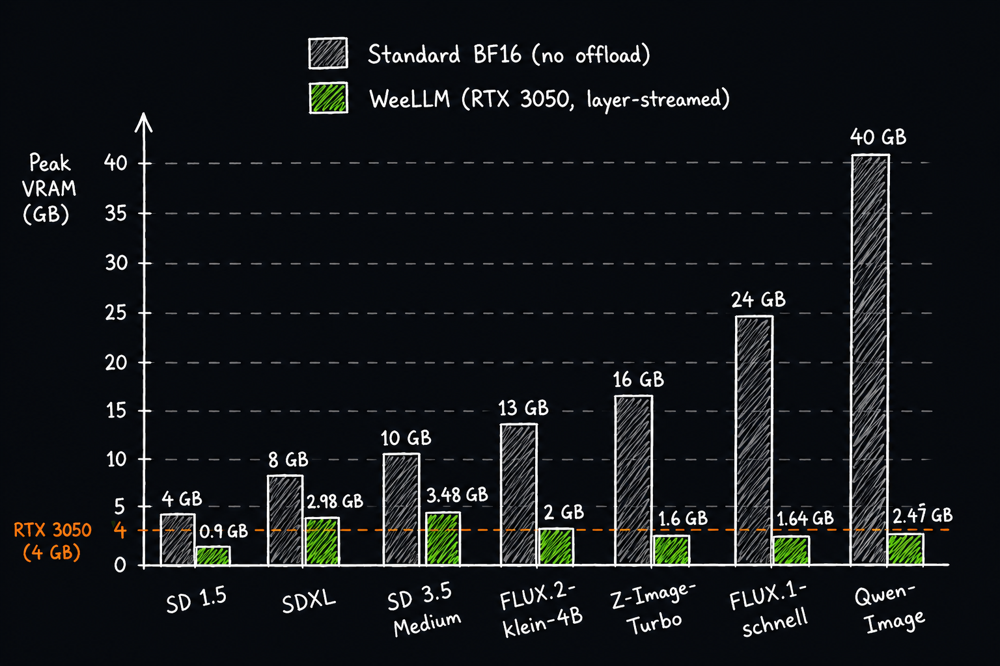

<div align="center">
  
  
  
  <br>
  <a href="https://www.kaggle.com/code/freedomfighter1290/weellm"></a>
</div>

# Layer-streaming inference for large diffusion models — Under 4 GB VRAM, no quantization

WeeLLM dynamically streams transformer layers to the GPU for massive models. Instead of forcing the entire model into VRAM, it intelligently pins as many blocks as your hardware allows, and seamlessly streams the rest layer-by-layer in the background — enabling massive models to run smoothly on budgets as low as 4GB VRAM.

---

## Some Benchmarks(For RTX 3050 Having <4GB Vram)

| Model                              | Parameters |   Peak VRAM |    Peak RAM | Time (1024x1024) |
| --------------------------------   | ---------: | ----------: | ----------: | ---------------: |
| `SDXL` (Juggernaut XL v9)          |      ~6.6B | **2.98 GB** | **1.50 GB** | ~120s · 20 steps |
| `SD 1.5`                           |      ~1.7B | **0.90 GB** | **1.40 GB** |  ~68s · 20 steps |
| `SD 3.5 Medium`                    |        ~8B | **3.48 GB** | **3.96 GB** | ~219s · 20 steps |
| `FLUX.1-dev`                       |       ~12B | **1.51 GB** | **~2.0 GB** |                — |
| `FLUX.1-Kontext-dev`               |       ~12B | **1.51 GB** | **~2.0 GB** |                — |
| `FLUX.1-schnell`                   |       ~12B | **1.64 GB** | **1.68 GB** |  ~159s · 4 steps |
| `FLUX.2-klein-4B`                  |         4B |  **2.0 GB** |  **2.3 GB** |   ~61s · 4 steps |
| `Lumina-Image-2.0`                 |        ~2B | **1.38 GB** |           — |                — |
| `CogView4-6B`                      |       ~15B | **2.44 GB** | **1.92 GB** | ~411s · 10 steps |
| `Z-Image-Turbo`                    |       ~10B | **1.60 GB** | **1.70 GB** |  ~167s · 4 steps |
| `HiDream-I1-Full`                  |       ~15B | **3.68 GB** | **2.02 GB** | ~797s · 10 steps |
| `LongCat-Image`                    |        ~9B | **2.19 GB** |           — | ~200s · 10 steps |
| `Qwen-Image` (`Qwen/Qwen-Image`)   |       ~20B | **2.47 GB** | **1.60 GB** | ~795s · 10 steps |
| `AuraFlow` (`fal/AuraFlow`)        |        ~4B | **1.34 GB** | **1.61 GB** | ~405s · 10 steps |
| `ERNIE-Image` (`Baidu/ERNIE-Image`)|       ~10B | **1.69 GB** | **2.54 GB** | ~123s · 5 steps  |
| `Krea-2-Turbo`                     |       ~13B | **  3  GB** | **3.23 GB** | ~810s · 10 steps |
| `MiniMax-H3`                       |       ~34B | **3.14 GB** |           — |                — |

> The models run with **no quantization** on RTX-3050 — full bfloat16 (1024x1024) weights streamed layer-by-layer to GPU.

<div align="center">
  
</div>

# Supported Model List

## Image Generation Models

- SDXL
- SD 1.5
- SD 2.0
- SD 3.5 Medium
- SD 3.5 Large
- Flux.1 Dev
- Flux.1 Schnell
- Flux.1 Kontext
- Flux.1 Krea
- Flux.2 Klein 4B
- Flux.2 Klein 9B
- CogView 4
- LongCat Image
- Z-Image Turbo
- Z-Image Base
- Krea 2 Turbo
- Krea 2 Raw
- Qwen Image
- Ideogram 4
- ERNIE-Image
- ERNIE-Image-Turbo
- Lumina Image 2.0
- Hidream I1 Full
- Auraflow

## Image Edit Models

- LongCat Image Edit
- Sdxl Img To Img
- Flux.2 Klein 4B
- Flux.2 Klein 9B
- Flux.1 Fill Dev
- Qwen Image Edit
- HiDream E1 Full
- Flux.1 Kontext 

## Video Generation Models

- MiniMax-H3 (FL2VA)

---

## TODOs

- [ ] **ControlNet / T2I-Adapter Integration:** Enable structural conditioning (canny, depth, pose) while maintaining strict VRAM streaming budgets.
- [ ] **LoRA Support:** Dynamically load and apply LoRA weights during the layer-streaming process without bloating system Vram and RAM.

---

## Quick Start

```bash
pip install -r requirements.txt

# Run directly from a Hugging Face repository ID!
python main.py --model black-forest-labs/FLUX.1-dev --prompt "A majestic lion at golden hour"

# Run from a local folder (skips download)
python main.py --model ./my-local-flux-model --prompt "A cyberpunk city at night"
```

---

## ⚠️ Cloud vs. Local Execution Warning

> [!WARNING]
> **This streaming architecture is specifically optimized for local execution on modern PCs equipped with NVMe SSDs and modern GPUs. You will experience slowdowns on standard cloud instances due to restricted disk I/O speeds.**

---

## ⚠️ Autoregressive & Vision-Language Model Limitations

> Dense autoregressive text-to-image models (like GLM-Image or other Vision-Language Models) are **not practically supported** by SSD streaming without quantization.
> Unlike diffusion models which process latents in a few discrete steps (e.g., 4 to 20 steps), autoregressive models must generate tokens sequentially. A 1024x1024 image requires generating over 1000 tokens. Generating 1000 tokens means doing 1000 full forward passes through the massive text encoder. 
> Streaming a 20GB model from an SSD 1000 times requires transferring ~20 Terabytes of data, which mathematically takes **several hours** to generate a single image. While the code technically executes without crashing under 4GB VRAM, the wait time is completely impractical. If you wish to run these autoregressive models efficiently, you must use 4-bit/8-bit quantization so the weights can sit entirely in System RAM or VRAM.

---

## Python API

```python
from weellm import WeePipeline

pipe = WeePipeline.from_pretrained("Tongyi-MAI/Z-Image-Turbo", device="cuda")
image = pipe.generate(
    prompt="A serene Japanese zen garden at sunrise",
    height=512,
    width=512,
    num_inference_steps=4,
    seed=42,
)
image.save("output.png")
```

